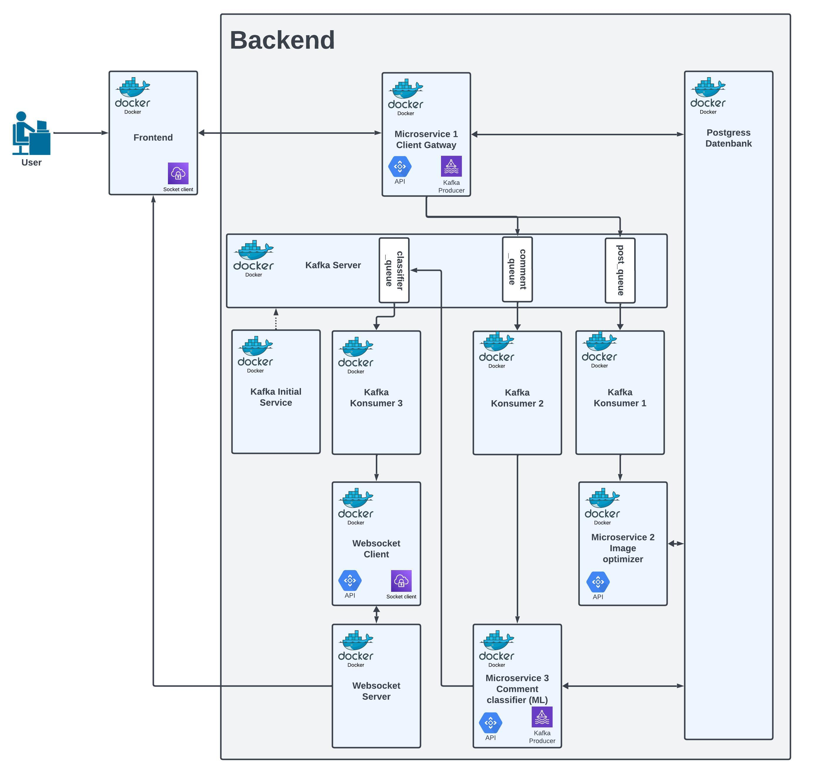

# Social-media-platform

This is the social media platform called BeFake. Users can generally create posts with photos and a description. These posts can then be commented on. Posts from other users are displayed randomly in the feed and your own posts are displayed in the Home. You can search for other users' posts in the feed using the search bar.

# Contributors (Name / Nummer : Github User)

Ivan Birkmaier / ai23m049 : IvanBirkmaier, Renaturepeople  
Leonard Hübner / ai23m040: Ruco26  
Patrick Steiner / ai23m055: Patrick  
Herbert Grünsteidl / ai23m012: herbertgruen

# Infrastructure:

**Database**: PostgreSQL  
**API**: FastAPI is used for communication between the backend and frontend (React).  
**Messaging**: Kafka serves as a messenger in the backend to enable asynchronous microservices.  
**Websocket**: Employed for real-time asynchronous communication between backend and frontend. For instance, comments are loaded only after the classification process during comment creation.  
**Containerization**: Docker ensures the application runs independently of the operating system.  
**Programming Languages**: Python and TypeScript

# Microservices:

1. CRUD Operations: A microservice dedicated to Create, Read, Update, and Delete operations.
2. Image Resizing: Handles the downsizing of images.
3. Comment Classification: Utilizes GPT-2 to classify comments as Positive (POS), Neutral (NEU), or Negative (NEG).

# Running the Application:

1. Start the app: `docker compose up -d`
2. Access the application at localhost:3000.
3. Verify all containers are operational, especially the microservices and consumers, using `docker ps`.

# Link to the Trello board for the projekt. 

You need to have permission for the [Trello board](https://trello.com/b/H6So0pAj/social-media-app).

# Enviroment Deployment-Diagramm

