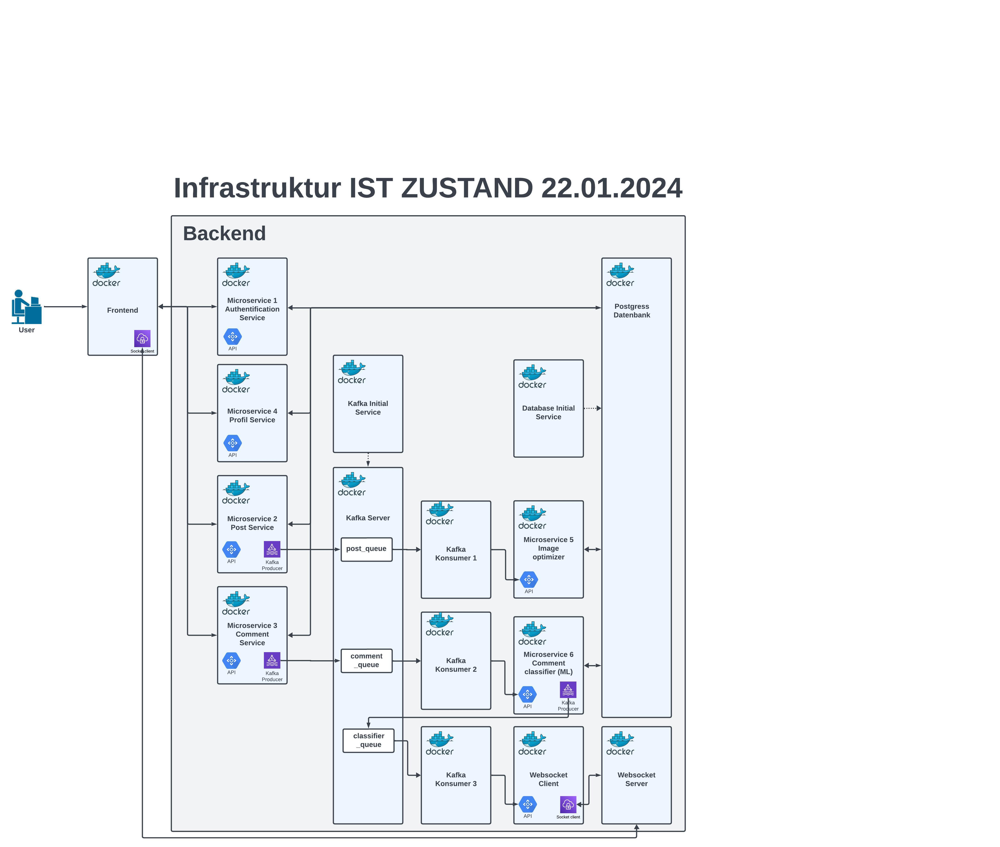
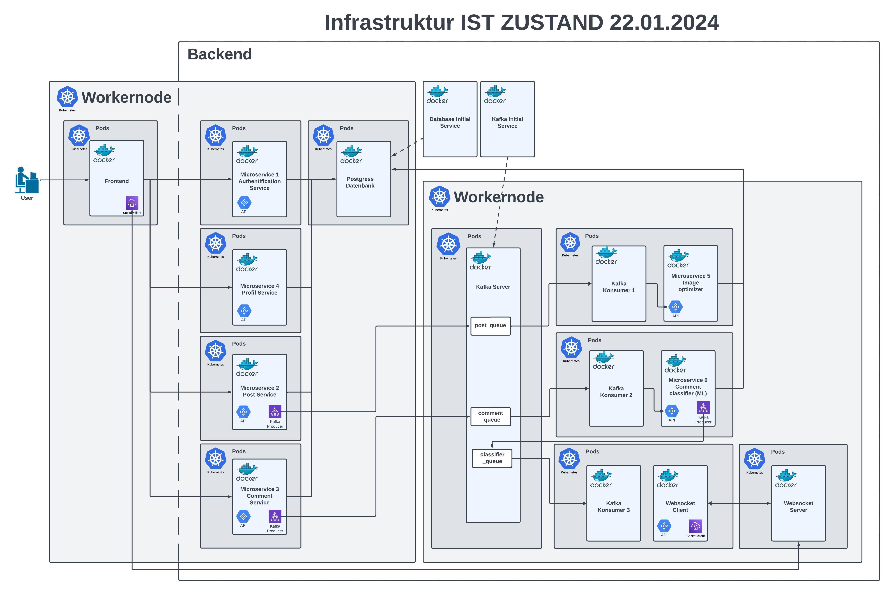
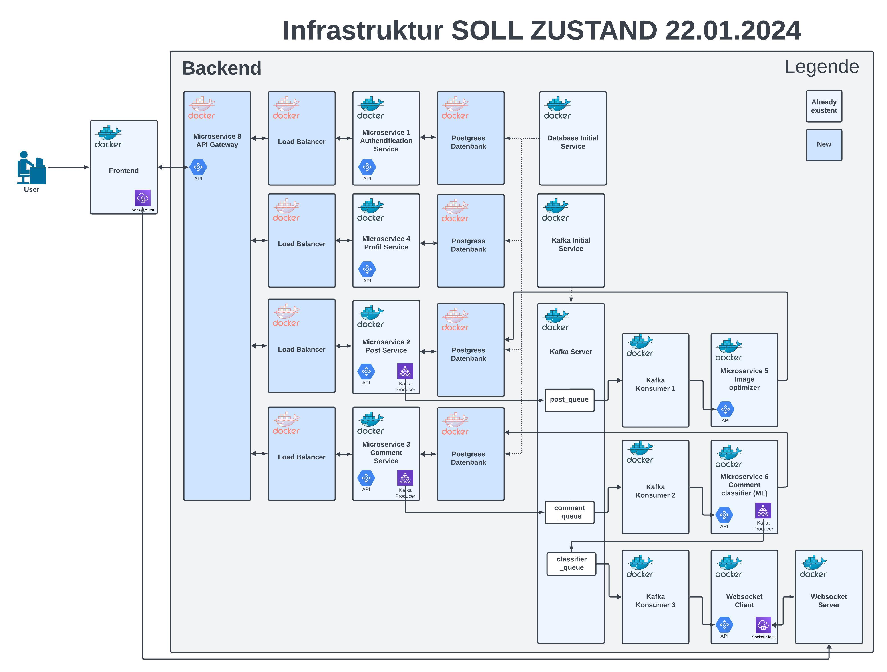
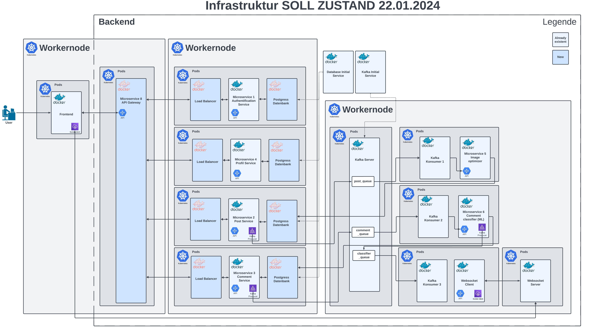

# Social Media Platform

This is the social media platform called BeFake. Users can create posts with photos and descriptions. These posts can then be commented on. Posts from other users are displayed randomly in the feed, and your own posts are displayed on the Home page. You can search for other users' posts in the feed using the search bar.

# Infrastructure & Technologies
**Database**: PostgreSQL  
**API**: FastAPI is used for communication between the backend and frontend (React).  
**Messaging**: Kafka serves as a messenger in the backend to enable asynchronous microservices.  
**Websocket**: Employed for real-time asynchronous communication between backend and frontend. For instance, comments are loaded only after the classification process during comment creation.  
**Containerization**: Docker ensures the application runs independently of the operating system.  
**Orchestration**: Kubernetes (K3d), Kafka  
**Programming Languages**: Python and TypeScript

# Microservices
1. **CRUD Operations**: A microservice dedicated to Create, Read, Update, and Delete operations.
2. **Image Resizing**: Handles the downsizing of images.
3. **Comment Classification**: Utilizes GPT-2 to classify comments as Positive (POS), Neutral (NEU), or Negative (NEG).

# Running the Application
1. Start the app: `docker compose up -d`
2. Access the application at [localhost:3000](http://localhost:3000).
3. Verify all containers are operational, especially the microservices and consumers, using `docker ps`.

# Current State Deployment Diagram without Kubernetes (22.01.2024)

# Current State Deployment Diagram with Kubernetes (22.01.2024)

# Future State Deployment Diagram without Kubernetes (22.01.2024)

# Future State Deployment Diagram with Kubernetes (22.01.2024)

